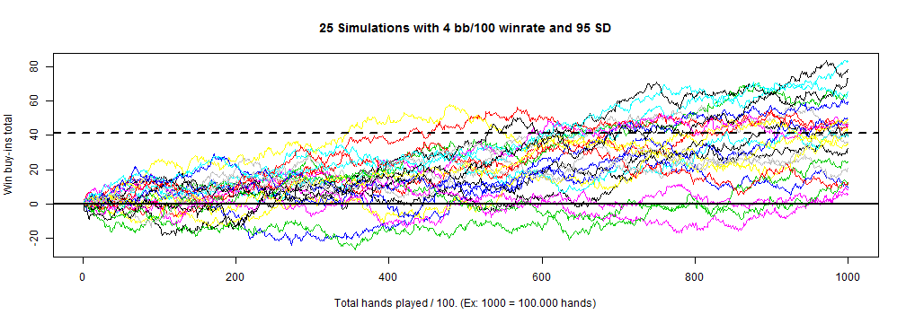

## Purpose

New poker players have problems to understand how variance can impact their results and how it works in the long term.  

This app was created to explain variance for poker players in the long term.  

---

## How it works

Based on two variables that are comom for the players, **Winrate** and **Standard Deviation**, we can plot a simulation of 100k hands played and see the possible outcomes in **Buy-ins**.  

That way, the players can have a clue for what to expect in terms of results (in buy-ins), in a range of 100k hands played based on their win rate and stardard deviation.

---

## What is the results? Real code run example:

After you input your variables, in this case **winrate 4, sd 95 and 25 trials**, you will got a plot like the one bellow:


```r
winrate <- 4;sd <- 95;trials <- 25
plotData(simulateData(winrate, sd, trials), winrate, sd, trials)
```

 

---

## Screen Shot

And now, one screen shot of the app running at shinyapps.io:


